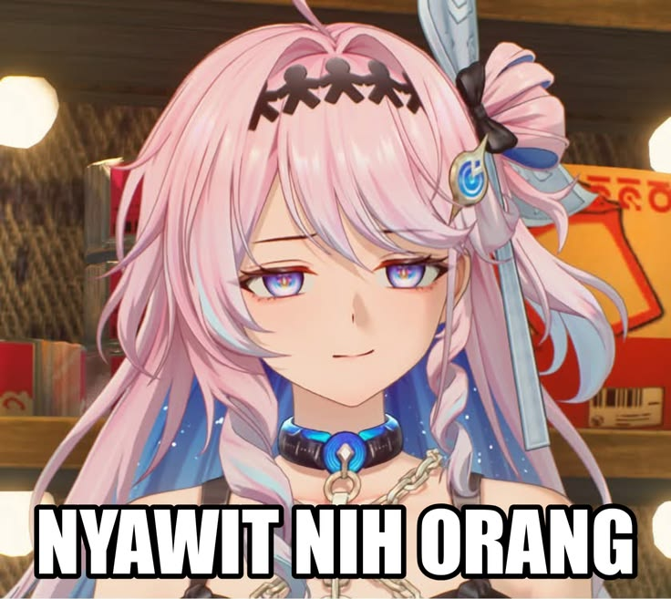
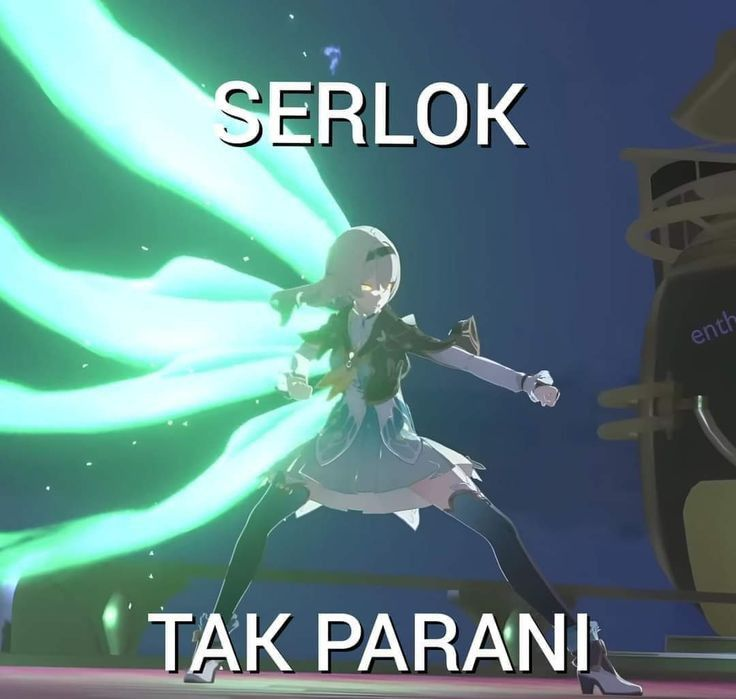
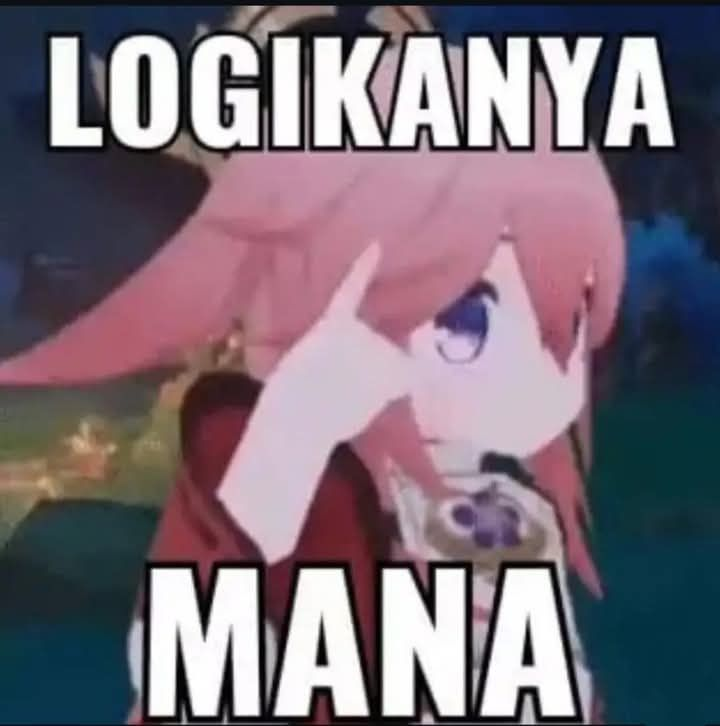
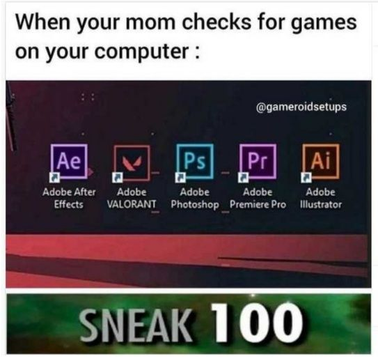
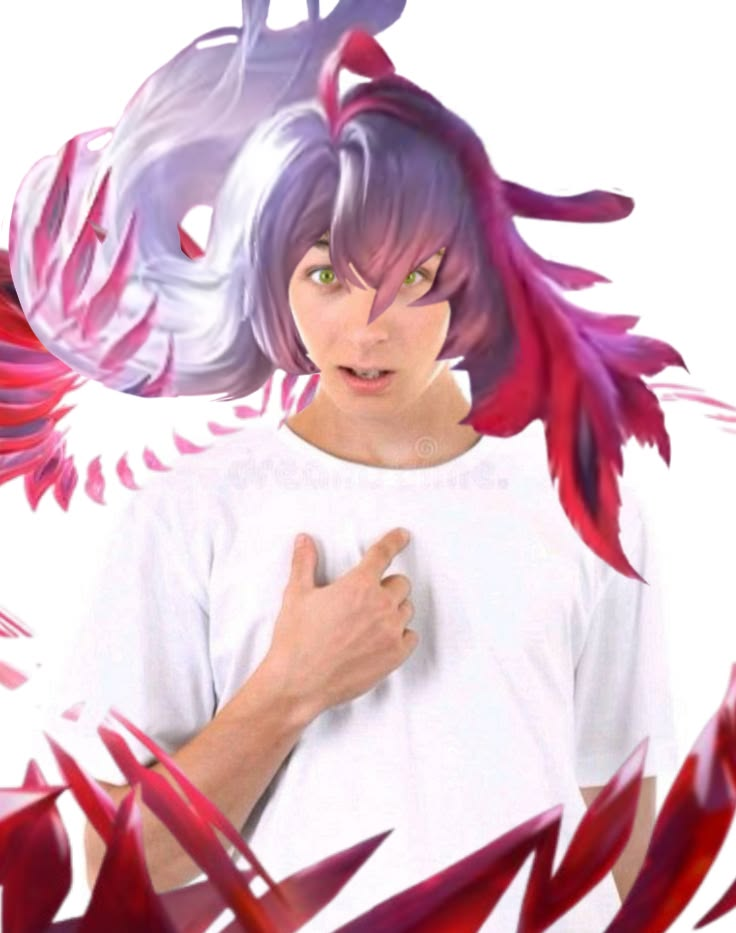
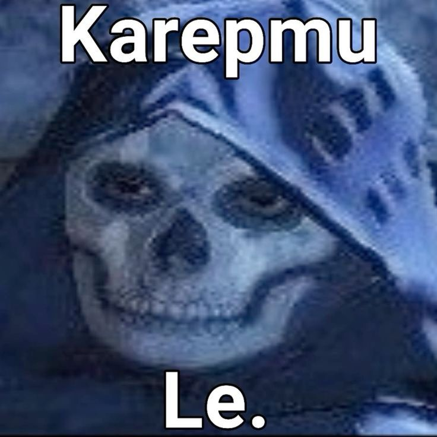
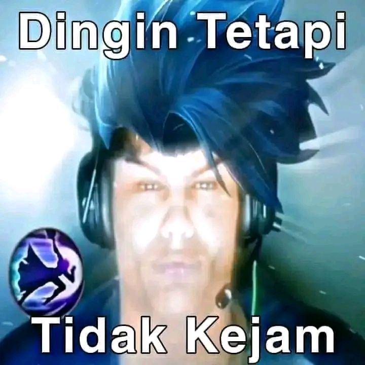
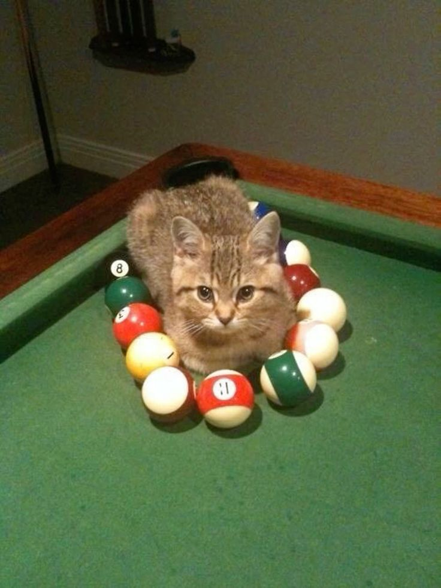

<!-- ================= HEADER ================= -->

<p align="center">
  
</p>

<p align="center">
  
</p>

<p align="center">
  
</p>

<p align="center">
  
  
  
</p>

---

# ABOUT ME

```ts
const azis = {
  role: "Fullstack Web Developer",
  location: "Madiun, East Java, Indonesia",
  education: "Informatics Engineering Student @ Universitas PGRI Madiun",

  interests: [
    "Web Development",
    "Cybersecurity",
    "Machine Learning",
    "Networking"
  ],

  currentlyLearning: [
    "Penetration Testing",
    "AI Deployment",
    "REST API Security",
    "Networking Automation"
  ],

  motto: "Design minimal. Code clean. Build secure."
}
```


# TECH STACK

### Languages

<p align="center">
  
</p>

### Frameworks

<p align="center">
  
</p>

### Tools

<p align="center">
  
</p>

---

# FAVORITE GAMES

<table align="center">
<tr>

<td align="center">
<br>
<b>Wuthering Waves</b>
</td>

<td align="center">
<br>
<b>Honkai Star Rail</b>
</td>

<td align="center">
<br>
<b>Genshin Impact</b>
</td>

<td align="center">
<br>
<b>Valorant</b>
</td>

</tr>

<tr>

<td align="center">
<br>
<b>Honor of Kings</b>
</td>

<td align="center">
<br>
<b>COD Mobile</b>
</td>

<td align="center">
<br>
<b>Mobile Legends</b>
</td>

<td align="center">
<br>
<b>Billiard</b>
</td>

</tr>
</table>

---

# CONNECT WITH ME

<p align="center">

<a href="https://github.com/aazziiss-jpg">

</a>

<a href="https://www.linkedin.com/in/azis-alaudin-alam-77b3ab326">

</a>

<a href="https://www.instagram.com/_azxlm/">

</a>

<a href="mailto:azisalam0@gmail.com">

</a>

</p>

---

<p align="center">
  
</p>

<p align="center">
  <i>"Build something simple. Make it secure. Keep learning."</i>
</p>

<p align="center">
  
</p>
